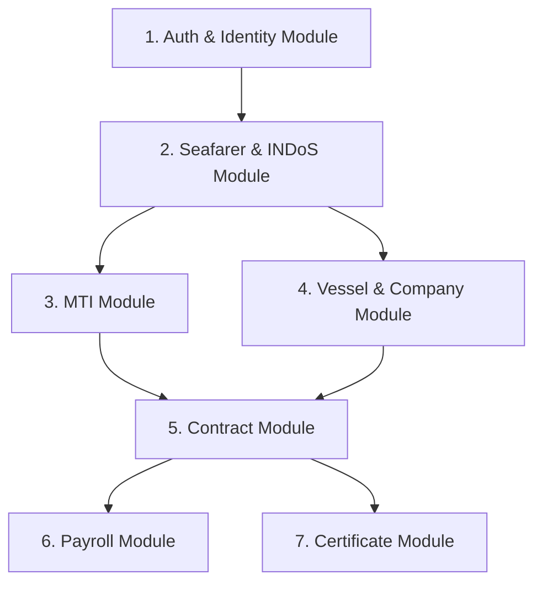

# Artemis Project Plan

This document defines the Modulith architecture, global Role-Based Access Control (RBAC) strategy, directory structure, and development timeline for the modules of the Artemis project.

## Modulith Architecture Overview

Artemis is designed as a Modular Monolith. Each module is encapsulated in its own package hierarchy with a strict public API boundary at the root level and private implementation details enclosed in an `internal` package. 

```
com.mralmostcool.artemis
├── auth/                       # Auth public API boundary
│   └── internal/               # Auth private implementation (dto, model, repo, security)
├── seafarer/                   # Seafarer public API boundary
│   └── internal/               # Seafarer private implementation
├── institute/                  # Institute public API boundary
│   └── internal/               # Institute private implementation
├── vessel/                     # Vessel & Company public API boundary
│   └── internal/               # Vessel private implementation
├── contract/                   # Contract public API boundary
│   └── internal/               # Contract private implementation
├── payroll/                    # Payroll public API boundary
│   └── internal/               # Payroll private implementation
└── certificate/                # Certificate public API boundary
    └── internal/               # Certificate private implementation
```

---

## Global RBAC Strategy

The application integrates with Supabase JWT. Roles are mapped to Spring Security Granted Authorities with the `ROLE_` prefix.

### Roles and Hierarchical Matrix

| Role | Organization Type | Access Level | Description |
| :--- | :--- | :--- | :--- |
| `ROLE_DG_SHIPPING_ADMIN` | `DG_SHIPPING` | **Master Access** | Global override. Read/Write all tables. Manages Master tables (institutes, companies, ranks). |
| `ROLE_DG_SHIPPING_L1` | `DG_SHIPPING` | **DG L1 Officer** | Performs first-level verification of seafarer training records. |
| `ROLE_DG_SHIPPING_L2` | `DG_SHIPPING` | **DG L2 Officer** | Performs final approval and sign-off on certificate issuance. |
| `ROLE_COMPANY_ADMIN` | `COMPANY` | **Company Master** | Manages Company profiles, invites/status of Company Users. |
| `ROLE_COMPANY_USER` | `COMPANY` | **Company Operator** | Manages vessels, berth allocations, contracts for their specific company. |
| `ROLE_INSTITUTE_ADMIN` | `INSTITUTE` | **Institute Master** | Manages MTI details, schedules, status of MTI Users. |
| `ROLE_INSTITUTE_USER` | `INSTITUTE` | **Institute Instructor** | Manages courses, schedules, enrollments for their specific institute. |
| `ROLE_CANDIDATE` | None (`null`) | **Individual Access** | Read-only access to own profile, training history, and active contracts. |

---

## Module Specifications

Detailed specifications for each module are documented in the [project_plan](file:///c:/Users/Neeraj%20Gupta/Projects/mralmostcool/artemis/project_plan) directory:

1. **Auth & Identity Module**: [auth.md](file:///c:/Users/Neeraj%20Gupta/Projects/mralmostcool/artemis/project_plan/auth.md)
   - Handles authentication, profile management, organization management, and API access enforcement.
2. **Seafarer & INDoS Module**: [seafarer.md](file:///c:/Users/Neeraj%20Gupta/Projects/mralmostcool/artemis/project_plan/seafarer.md)
   - Manages ranks and the Indian National Database of Seafarers. Includes medical logs.
3. **Maritime Training Institute Module**: [institute.md](file:///c:/Users/Neeraj%20Gupta/Projects/mralmostcool/artemis/project_plan/institute.md)
   - Manages institutes, course scheduling, DG Shipping seat quota approvals, mock course checkouts/payments, and candidate enrollments.
4. **Vessel, Company & Berth Allocation Module**: [vessel.md](file:///c:/Users/Neeraj%20Gupta/Projects/mralmostcool/artemis/project_plan/vessel.md)
   - Tracks companies, vessel fleets, harbor berths (minimum 1-year stays), training slot allocations, and DG Shipping tax/port concession credits.
5. **Contract Module**: [contract.md](file:///c:/Users/Neeraj%20Gupta/Projects/mralmostcool/artemis/project_plan/contract.md)
   - Coordinates seafarer employment agreements (minimum 100 days stint), verifying training pre-requisites and embarkation sign-on/sign-off logs.
6. **Payroll Module**: [payroll.md](file:///c:/Users/Neeraj%20Gupta/Projects/mralmostcool/artemis/project_plan/payroll.md)
   - Handles monthly wages computation, conversion of USD wages to target currencies (INR, EUR), and pay slip logging.
7. **Certificate Module**: [certificate.md](file:///c:/Users/Neeraj%20Gupta/Projects/mralmostcool/artemis/project_plan/certificate.md)
   - Handles sea-service certification initiation, 2-level DG Shipping reviews, and final company allotment.

---

## Recommended Development Order

To respect database foreign key dependencies and domain boundaries, develop modules in the following order:



1. **`auth` Module**: Foundation for API request authentication, user records, and role identification.
2. **`seafarer` Module**: Defines ranks (`rank_master`) and INDoS numbers (`indos_master`) which are central foreign keys.
3. **`institute` Module**: Depends on INDoS mapping for student enrollment registration.
4. **`vessel` Module**: Depends on INDoS mapping for berth seafarer allocation, and registers shipping companies.
5. **`contract` Module**: Final integrator. Depends on data from `seafarer`, `vessel`, and `institute` modules.
6. **`payroll` Module**: Processes wage records linked to `ACTIVE` status contracts.
7. **`certificate` Module**: Depends on `contract` (sea service completion), `institute` (pre-sea verification), and `seafarer` (INDoS). Developed last.

---

## Core Regulatory Workflows

### 1. Training Seat Quota and Vessel Mapping
MTIs schedule courses and request seat quotas. Once registration closes and candidates complete course checkout, they are assigned to ship berths for training. Berths are allocated to vessels for minimum 1-year terms. Multiple candidates can occupy a seat sequentially (uniquely tracked by `berth_seafarer_allocation_id`), but no two candidates can occupy the same seat at the same time.

### 2. Sea-Service Stint Rules
All cadet training stints must be a minimum of **100 days**. MTIs can request extensions to these limits if curriculum demands it. Contracts capture expected dates at start, but store actual sign-on/sign-off dates, ports, and countries dynamically upon boarding and disembarkation.

### 3. Shipping Company Concession Credits
In exchange for offering training berths on their vessels, shipping companies earn Concession Credits approved by DG Shipping. The value is tracked in the `concession_ledger` based on active cadet sea-days, granting operators visibility into total concessions generated.
